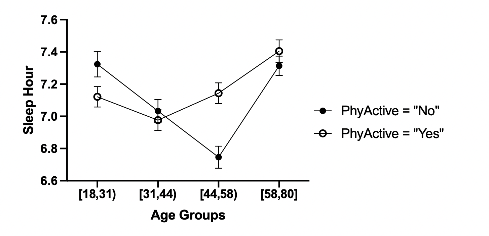
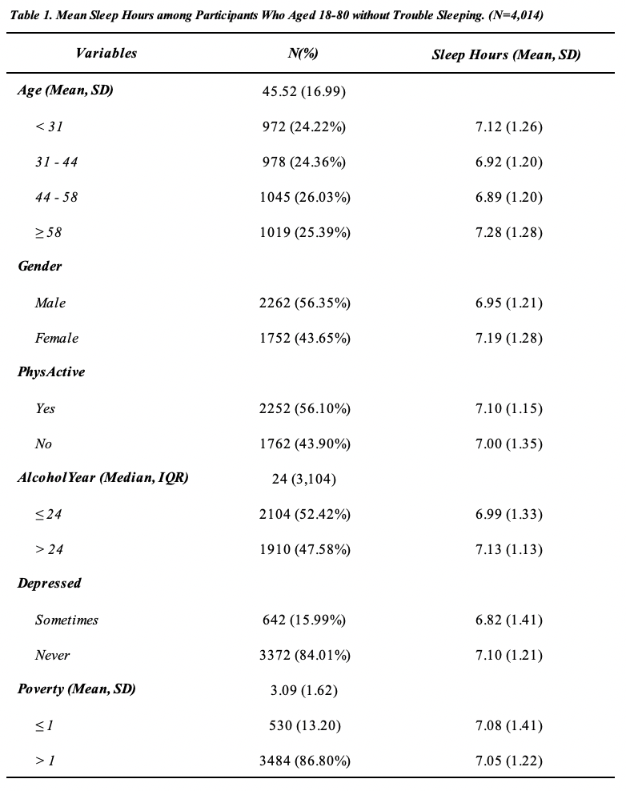

```{r, include=FALSE}
library(dplyr)
library(ggplot2)
library(gridExtra)
library(knitr)
```

```{r, collapse=TRUE}
library(NHANES)
raw.data <- force(NHANES) #import dateset

##  only keep "SleepHrsNight"，"SleepTrouble", "Age", "Gender", 
## "Poverty", "PhysActive", "AlcoholYear"
data.selected <- raw.data %>% select(c("SleepHrsNight", "SleepTrouble", "Age", "Gender",
                                       "Poverty", "PhysActive", "AlcoholYear", "Depressed"))
dim(data.selected)  
```

# 1.Preliminary data clean 

## (1) Define study population &  check missing values
```{r,collapse=TRUE}
## Study population: (1) age 18+ (2) No SleepTrouble
data.population <- data.selected[which(data.selected$Age >= 18 & data.selected$SleepTrouble == "No"),] 
dim(data.population)

## missing value
missing.table <- data.frame(
  col1 = c("SleepHrsNight", "Age", "Gender", "Poverty", "Depressed", "PhysActive", "AlcoholYear"),
  col2 = c(sum(is.na(data.population$SleepHrsNight)),sum(is.na(data.population$Age)), 
           sum(is.na(data.population$Gender)),sum(is.na(data.population$Poverty)), 
           sum(is.na(data.population$Depressed)), sum(is.na(data.population$PhysActive)), 
           sum(is.na(data.population$AlcoholYear))),
  col3 = c(sum(!is.na(data.population$SleepHrsNight)),sum(!is.na(data.population$Age)), 
           sum(!is.na(data.population$Gender)),sum(!is.na(data.population$Poverty)), 
           sum(!is.na(data.population$Depressed)), sum(!is.na(data.population$PhysActive)),
           sum(!is.na(data.population$AlcoholYear))))
missing.table$col4 <- round(missing.table$col3/(missing.table$col2 + missing.table$col3) * 100,
                            digits = 2)
colnames(missing.table) <- c("Variables", "#. missing", "#. completed", "% completed")
print(kable(missing.table, align = c('c', 'c', 'c', 'c')))
```

## (2) Delete missing value

```{r, collapse=TRUE}
data.complete <-  na.omit(data.population)
# dim(data.complete)
# head(data.complete)
```

## (3) Create new age groups (by quartile) & combine "Depressed" & centered continuous variable
```{r,collapse=TRUE}
## Create new age groups
quantile.age <- quantile(data.complete$Age)
print(quantile.age)
data.complete$Age_cate1 <- 1 * (data.complete$Age < quantile.age[2])  #group1: [18,31)
data.complete$Age_cate2 <- 1 * (data.complete$Age >= quantile.age[2] 
                                & data.complete$Age < quantile.age[3]) #group1: [31,44)
data.complete$Age_cate3 <- 1 * (data.complete$Age >= quantile.age[3] 
                                & data.complete$Age < quantile.age[4]) #group1: [44,58)
data.complete$Age_cate4 <- 1 * (data.complete$Age >= quantile.age[4])  #group4: [58,80)

## combine "Depressed"
## None = "No"; Several & Most ="Yes"
data.complete$depressed_binary[data.complete$Depressed == "None"] <- "No"
data.complete$depressed_binary[data.complete$Depressed == "Several" |
                                 data.complete$Depressed == "Most"] <- "Yes"

## centered Poverty (- median)
## The main reason for data centralization is to make it easier to interpret the results.
median.poverty <- median(data.complete$Poverty)
data.complete$center.poverty <- data.complete$Poverty - median.poverty
```

## (4) Do log-transformation on AlcoholYears
```{r,collapse=TRUE}
data.clean <- data.complete %>% select(-c("Age", "SleepTrouble", "Depressed", "Poverty"))
AlcoholYear.plot <- ggplot() + geom_density(aes(log(AlcoholYear+1)), data.clean) + 
    theme(panel.grid = element_blank(), panel.background = element_blank(), 
        axis.line = element_line(colour = "black"))

AlcoholYear.plot2 <- ggplot() + geom_density(aes(AlcoholYear), data.clean) + 
    theme(panel.grid = element_blank(), panel.background = element_blank(), 
        axis.line = element_line(colour = "black"))

grid.arrange(AlcoholYear.plot2, AlcoholYear.plot, nrow = 2)
head(data.clean, n = 5)
```

```{r,include=FALSE}
attach(data.clean)
```

# 2. Fit the model

## (1) SLR: PhysActive v.s. SleepHrsNight 
$\beta=0.094$, and $p$=0.018

```{r,collapse=TRUE}
lm.model1 <- lm(SleepHrsNight ~ PhysActive)
summary(lm.model1)
```


## (2) MLR with interaction

```{r,collapse=TRUE}
lm.model3 <- lm(SleepHrsNight ~ Gender + center.poverty + PhysActive + log(AlcoholYear + 1) + 
                  depressed_binary + Age_cate2 + Age_cate3 + Age_cate4 + 
                  PhysActive*Age_cate2 + PhysActive*Age_cate3 + PhysActive*Age_cate4)
summary(lm.model3)
m3.residuals <- lm.model3$residuals
```
You can get some ideas about how to create a summary table of MLR from this [article](https://www.ncbi.nlm.nih.gov/pmc/articles/PMC2783185/)  (Table3).

## (3) calculate point estimate & standard error
```{r}
summary.model3 <- summary(lm.model3)
beta <- summary.model3$coefficients[c(1, 4, 7, 8, 9, 10, 11, 12), 1]
std <- summary.model3$coefficients[c(1, 4, 7, 8, 9, 10, 11, 12), 2]

## Age group1
Phy.no.meanY.in.age1 <-
  c(c(1, 0, 0, 0, 0, 0, 0, 0, 0, 0, 0, 0) %*% coef(summary.model3))[1]
Phy.no.std.in.age1 <-
  c(c(1, 0, 0, 0, 0, 0, 0, 0, 0, 0, 0, 0) %*% vcov(lm.model3) %*% 
      c(1, 0, 0, 0, 0, 0, 0, 0, 0, 0, 0, 0))
confint.age1.1 <-
  Phy.no.meanY.in.age1 + c(-1, 1) * qt(p = 0.975, df = summary.model3$df[2]) * 
  sqrt(Phy.no.std.in.age1)

Phy.yes.meanY.in.age1 <-
  c(c(1, 0, 0, 1, 0, 0, 0, 0, 0, 0, 0, 0) %*% coef(summary.model3))[1]
Phy.yes.std.in.age1 <-
  c(c(1, 0, 0, 1, 0, 0, 0, 0, 0, 0, 0, 0) %*% vcov(lm.model3) %*% 
      c(1, 0, 0, 1, 0, 0, 0, 0, 0, 0, 0, 0))
confint.age1.2 <-
  Phy.yes.meanY.in.age1 + c(-1, 1) * qt(p = 0.975, df = summary.model3$df[2]) * 
  sqrt(Phy.yes.std.in.age1)

## Age group2
Phy.no.meanY.in.age2 <-
  c(c(1, 0, 0, 0, 0, 0, 1, 0, 0, 0, 0, 0) %*% coef(summary.model3))[1]
Phy.no.std.in.age2 <-
  c(c(1, 0, 0, 0, 0, 0, 1, 0, 0, 0, 0, 0) %*% vcov(lm.model3) %*% 
      c(1, 0, 0, 0, 0, 0, 1, 0, 0, 0, 0, 0))
confint.age2.1 <-
  Phy.no.meanY.in.age2 + c(-1, 1) * qt(p = 0.975, df = summary.model3$df[2]) * 
  sqrt(Phy.no.std.in.age2)

Phy.yes.meanY.in.age2 <-
  c(c(1, 0, 0, 1, 0, 0, 1, 0, 0, 1, 0, 0) %*% coef(summary.model3))[1]
Phy.yes.std.in.age2 <-
  c(c(1, 0, 0, 1, 0, 0, 1, 0, 0, 1, 0, 0) %*% vcov(lm.model3) %*% 
      c(1, 0, 0, 1, 0, 0, 1, 0, 0, 1, 0, 0))
confint.age2.2 <-
  Phy.yes.meanY.in.age2 + c(-1, 1) * qt(p = 0.975, df = summary.model3$df[2]) * 
  sqrt(Phy.yes.std.in.age2)

## Age group3
Phy.no.meanY.in.age3 <-
  c(c(1, 0, 0, 0, 0, 0, 0, 1, 0, 0, 0, 0) %*% coef(summary.model3))[1]
Phy.no.std.in.age3 <-
  c(c(1, 0, 0, 0, 0, 0, 0, 1, 0, 0, 0, 0) %*% vcov(lm.model3) %*% 
      c(1, 0, 0, 0, 0, 0, 0, 1, 0, 0, 0, 0))
confint.age3.1 <-
  Phy.no.meanY.in.age3 + c(-1, 1) * qt(p = 0.975, df = summary.model3$df[2]) * 
  sqrt(Phy.no.std.in.age3)

Phy.yes.meanY.in.age3 <-
  c(c(1, 0, 0, 1, 0, 0, 0, 1, 0, 0, 1, 0) %*% coef(summary.model3))[1]
Phy.yes.std.in.age3 <-
  c(c(1, 0, 0, 1, 0, 0, 0, 1, 0, 0, 1, 0) %*% vcov(lm.model3) %*% 
      c(1, 0, 0, 1, 0, 0, 0, 1, 0, 0, 1, 0))
confint.age3.2 <-
  Phy.yes.meanY.in.age3 + c(-1, 1) * qt(p = 0.975, df = summary.model3$df[2]) * 
  sqrt(Phy.yes.std.in.age3)

## Age group4
Phy.no.meanY.in.age4 <-
  c(c(1, 0, 0, 0, 0, 0, 0, 0, 1, 0, 0, 0) %*% coef(summary.model3))[1]
Phy.no.std.in.age4 <-
  c(c(1, 0, 0, 0, 0, 0, 0, 0, 1, 0, 0, 0) %*% vcov(lm.model3) %*% 
      c(1, 0, 0, 0, 0, 0, 0, 0, 1, 0, 0, 0))
confint.age4.1 <-
  Phy.no.meanY.in.age2 + c(-1, 1) * qt(p = 0.975, df = summary.model3$df[2]) * 
  sqrt(Phy.no.std.in.age2)

Phy.yes.meanY.in.age4 <-
  c(c(1, 0, 0, 1, 0, 0, 0, 0, 1, 0, 0, 1) %*% coef(summary.model3))[1]
Phy.yes.std.in.age4 <-
  c(c(1, 0, 0, 1, 0, 0, 0, 0, 1, 0, 0, 1) %*% vcov(lm.model3) %*% 
      c(1, 0, 0, 1, 0, 0, 0, 0, 1, 0, 0, 1))
confint.age4.2 <-
  Phy.yes.meanY.in.age4 + c(-1, 1) * qt(p = 0.975, df = summary.model3$df[2]) * 
  sqrt(Phy.yes.std.in.age4) 
```

## (4) Effect of PhyActive in different age groups

 

I created this figure by $Prism \ 9$,but we should use R to get this plot

If Runshu and Haoyue are not familiar with ggplot2, you can find some tutorials from this *[link](http://www.cookbook-r.com/Graphs/Plotting_means_and_error_bars_(ggplot2)/)*

## (5) Check residuals

```{r, collapse=TRUE, fig.height = 6, fig.width = 10, fig.align = "center", warning=FALSE}
par(mfrow = c(1, 2))
hist(m3.residuals)
car::qqPlot(m3.residuals)
```

## (6) Sequential F-test

Check whether age modified the association between PhyActive and Sleep time.

```{r,collapse=TRUE}
anova.table <- anova(lm.model3)
sequential.F.statistics <- ((anova.table$`Sum Sq`[9] + anova.table$`Sum Sq`[10] + 
                               anova.table$`Sum Sq`[11])/3)/anova.table$`Mean Sq`[12]
print(sequential.F.statistics)
qf(0.95, 3, anova.table$Df[12])
pf(sequential.F.statistics, 3, anova.table$Df[12], lower.tail = FALSE) # p <0.001
```

# 3. Brief intepretation:

* We estimated that, among people aged 18-31, comparing people who don't have physical activities, the sleep time of those who have physical activities is 0.203 hours significantly shorter (p=0.016), adjusted for others covariates.

* Age will change the effect of physical activities on sleep hour (Sequential F test, p < 0.001).

* Report the point estimate of physical activities effects and p-value in each age group (among female (Gendermale = 0), who has median poverty (center.poverty = 0), never drink (log(AlcoholYear + 1) = 0), no depression (depressed_binaryYes = 0), and no sleep disorder
). (need to calculate $se(\sum\beta's)$)

* ...

# 4. Descriptive table

```{r, include=FALSE}
## Age
mean.age <- round(mean(data.complete$Age), digits = 2)
sd.age <- round(sd(data.complete$Age), digits = 2)

sum(data.clean$Age_cate1)
round(sum(data.clean$Age_cate1)/nrow(data.clean), digits = 4)
sum(data.clean$Age_cate2)
round(sum(data.clean$Age_cate2)/nrow(data.clean), digits = 4)
sum(data.clean$Age_cate3)
round(sum(data.clean$Age_cate3)/nrow(data.clean), digits = 4)
sum(data.clean$Age_cate4)
round(sum(data.clean$Age_cate4)/nrow(data.clean), digits = 4)

aggregate(data.clean$SleepHrsNight, by = list(data.clean$Age_cate1), mean)
aggregate(data.clean$SleepHrsNight, by = list(data.clean$Age_cate1), sd)

aggregate(data.clean$SleepHrsNight, by = list(data.clean$Age_cate2), mean)
aggregate(data.clean$SleepHrsNight, by = list(data.clean$Age_cate2), sd)

aggregate(data.clean$SleepHrsNight, by = list(data.clean$Age_cate3), mean)
aggregate(data.clean$SleepHrsNight, by = list(data.clean$Age_cate3), sd)

aggregate(data.clean$SleepHrsNight, by = list(data.clean$Age_cate4), mean)
aggregate(data.clean$SleepHrsNight, by = list(data.clean$Age_cate4), sd)

## gender
table(data.clean$Gender, useNA = "ifany")
round(table(data.clean$Gender, useNA = "ifany")/nrow(data.clean), digits = 4)

aggregate(data.clean$SleepHrsNight, by = list(data.clean$Gender), mean)
aggregate(data.clean$SleepHrsNight, by = list(data.clean$Gender), sd)

## PhysActive
table(data.clean$PhysActive, useNA = "ifany")
round(table(data.clean$PhysActive, useNA = "ifany")/nrow(data.clean), digits = 4)

aggregate(data.clean$SleepHrsNight, by = list(data.clean$PhysActive), mean)
aggregate(data.clean$SleepHrsNight, by = list(data.clean$PhysActive), sd)

## AlcoholYear
quantile(data.clean$AlcoholYear)
sum(data.clean$AlcoholYear <= 24)
round(sum(data.clean$AlcoholYear <= 24)/nrow(data.clean), digits = 4)
sum(data.clean$AlcoholYear > 24)
round(sum(data.clean$AlcoholYear > 24)/nrow(data.clean), digits = 4)

alco.binary <- ifelse(data.clean$AlcoholYear <= 24, 0, 1)
aggregate(data.clean$SleepHrsNight, by = list(alco.binary), mean)
aggregate(data.clean$SleepHrsNight, by = list(alco.binary), sd)

## Depressed
table(data.clean$depressed_binary)
round(table(data.clean$depressed_binary)/nrow(data.clean), digits = 4)

aggregate(data.clean$SleepHrsNight, by = list(data.clean$depressed_binary), mean)
aggregate(data.clean$SleepHrsNight, by = list(data.clean$depressed_binary), sd)

## Poverty
mean(data.complete$Poverty)
sd(data.complete$Poverty)

sum(data.complete$Poverty <= 1)
round(sum(data.complete$Poverty <= 1)/nrow(data.clean), digits = 5)
sum(data.complete$Poverty > 1)
round(sum(data.complete$Poverty > 1)/nrow(data.clean), digits = 5)

poverty.binary <- ifelse(data.complete$Poverty <= 1, 0, 1)

aggregate(data.clean$SleepHrsNight, by = list(poverty.binary), mean)
aggregate(data.clean$SleepHrsNight, by = list(poverty.binary), sd)
```

 
